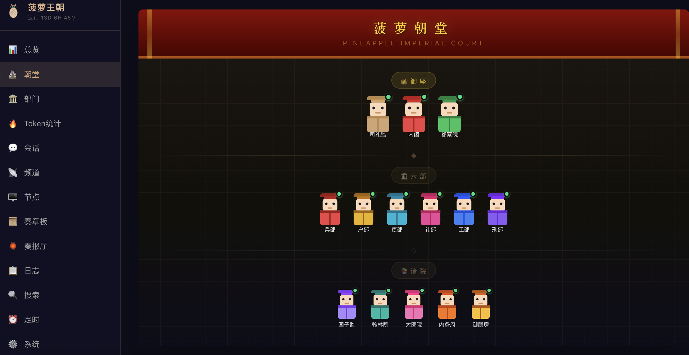
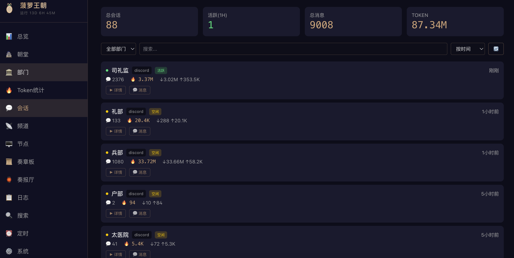

[English Version](./README_EN.md) | [🏢 企业版 Become CEO (English)](https://github.com/wanikua/become-ceo)

<!-- SEO 关键词 / Keywords：三省六部、明朝、六部制、中书省、门下省、尚书省、司礼监、兵部、户部、礼部、工部、刑部、吏部、AI朝廷、AI Agent、多Agent协作、人工智能管理、古代治国、现代管理、组织架构、OpenClaw、multi-agent、ancient-china -->

# 🏛️ AI 朝廷 — 用明代六部制管理你的 AI Agent 团队

### 30 分钟搭建 · 多 Agent 协作 · 零代码 · 古代治国智慧 × 现代 AI 管理

> **以明朝三省六部制为蓝本，用 [OpenClaw](https://github.com/openclawai/openclaw) 框架构建的多 Agent 协作系统。**
> 一台服务器 + OpenClaw = 一支 7×24 在线的 AI 朝廷。

<p align="center">
  
  
  
  
  
</p>

<p align="center">
  
</p>

<p align="center">
  
</p>

---

## 目录

| | 章节 | 说明 |
|:---:|------|------|
| 📜 | [这个项目是什么？](#这个项目是什么) | 项目介绍、设计理念、核心能力 |
| 🆚 | [为什么选这套方案？](#为什么选这套方案) | 与 ChatGPT / AutoGPT / CrewAI 对比 |
| 🏗️ | [技术架构](#技术架构) | 三省六部映射、架构图 |
| 🎬 | [效果展示](#效果展示) | Discord 真实对话示例 |
| 🚀 | [**快速开始**](#快速开始) | **← 从这里开始安装** |
| | ├─ [Linux 服务器安装](#第一步一键部署5-分钟) | 一键脚本，5分钟搞定 |
| | ├─ [macOS 本地安装](#第一步一键部署5-分钟) | Homebrew 自动安装 |
| | ├─ [精简安装（已有 OpenClaw）](#第一步一键部署5-分钟) | 只初始化配置 |
| | ├─ [填 Key 上线](#第二步填-key-上线10-分钟) | API Key + Discord Bot Token |
| | └─ [全六部上线](#第三步全六部上线-自动化15-分钟) | 测试 + 配置自动化 |
| 🍍 | [实战案例：菠萝王朝](#实战案例菠萝王朝) | 14 Agent 真实运行架构 |
| 🏛️ | [朝廷架构详解](#朝廷架构三省六部制) | 历史背景、角色对照、多模型混搭 |
| ⚙️ | [核心能力详解](#核心能力) | 协作、记忆、Skill、Cron、沙箱 |
| 🖥️ | [GUI 管理界面](#gui-管理界面) | Web Dashboard + Discord + Notion |
| ❓ | [常见问题](#常见问题) | 基础 + 技术 FAQ |
| 🏢 | [企业版 Become CEO](#想要企业版) | 同架构的英文企业版 |
| 🔗 | [相关链接 & 社区](#加入朝会) | 小红书、公众号、微信群 |

---

## 这个项目是什么？

**AI 朝廷**是一个开箱即用的多 AI Agent 协作系统，将中国古代的**三省六部制**（中书省 · 门下省 · 尚书省 → 吏部 · 户部 · 礼部 · 兵部 · 刑部 · 工部）映射为现代 AI Agent 的组织架构。

**简单来说：** 你是皇帝，AI 是你的大臣。每位大臣各司其职——写代码的、管财务的、搞营销的、做运维的——你只需要在 Discord 里下一道「圣旨」（@某个 Agent），大臣们就会立刻执行。

### 为什么用古代朝廷架构？

古代三省六部制是人类历史上运行时间最久的组织管理体系之一（隋唐至清末，超过 1300 年）。它的核心设计理念：

- **职责分明** — 六部各司其职，互不越权（= AI Agent 各有专长）
- **流程标准化** — 奏折制度、批红制度（= Prompt 模板 + SOUL.md 人格注入）
- **权力制衡** — 三省互相制约（= Agent 互审、多步确认）
- **档案留存** — 起居注、实录制度（= Memory 持久化、Notion 自动归档）

这些思想完美映射到现代多 Agent 系统的设计需求。**古代治国的智慧，就是现代管理 AI 团队的最佳实践。**

### 核心能力一览

| 能力 | 描述 |
|------|------|
| **多 Agent 协作** | 7 个独立 AI Agent（六部 + 司礼监），各有专长，协同工作 |
| **独立记忆** | 每个 Agent 有独立工作区和 memory 文件，越用越懂你 |
| **60+ 内置 Skill** | GitHub、Notion、浏览器、Cron、TTS 等开箱即用 |
| **自动化任务** | Cron 定时任务 + 心跳自检，7×24 无人值守 |
| **沙箱隔离** | Docker 容器隔离，Agent 代码执行互不干扰 |
| **多平台支持** | Discord / 飞书 / Slack / Telegram 等，@mention 即可调用 |
| **Web 管理后台** | React + TypeScript 构建的 Dashboard，可视化管理 |
| **OpenClaw 生态** | 基于 [OpenClaw](https://github.com/openclawai/openclaw) 框架，可使用 [OpenClaw Hub](https://github.com/openclawai/openclaw) 的 Skill 生态 |

### 想要企业版？

如果你更熟悉现代企业管理概念，我们有**英文企业版**：

👉 **[Become CEO](https://github.com/wanikua/become-ceo)** — 同一套架构，用 CEO / CTO / CFO / CMO 等企业角色代替朝廷六部

| 朝廷角色 | 企业角色 | 职责 |
|:---:|:---:|:---:|
| 皇帝 | CEO | 最高决策者 |
| 司礼监 | COO / 首席运营官 | 日常调度、任务分配 |
| 兵部 | CTO / 工程VP | 软件工程、技术架构 |
| 户部 | CFO / 财务VP | 财务分析、成本管控 |
| 礼部 | CMO / 营销VP | 品牌营销、内容策划 |
| 工部 | VP Infra / SRE | DevOps、基础设施 |
| 吏部 | VP Product / PMO | 项目管理、团队协调 |
| 刑部 | General Counsel | 法务合规、合同审查 |

> 💡 两个项目基于相同的 [OpenClaw](https://github.com/openclawai/openclaw) 框架，架构完全一致，只是角色命名和文化背景不同。选你喜欢的风格即可！

---

> 📌 **关于原创性** — 本项目首次提交于 **2026-02-22**（[commit 记录](https://github.com/wanikua/boluobobo-ai-court-tutorial/commits/main)），是「用中国古代官制隐喻 AI 多 Agent 协作」这一概念的原始实现。我们注意到 [cft0808/edict](https://github.com/cft0808/edict)（首次提交 2026-02-23，晚约 21 小时）在框架选型、SOUL.md 人格文件、部署方式、竞品对比表格等方面与本项目高度一致，详见 [Issue #55](https://github.com/cft0808/edict/issues/55)。
>
> **欢迎转载，请注明出处。**
>
> 📕 小红书原创系列：[用AI当上皇帝的第3天，我已经欲罢不能了](https://www.xiaohongshu.com/discovery/item/6998638f000000000d0092fe) | [赛博皇帝的日常：睡前下旨，AI连夜肝完代码](https://www.xiaohongshu.com/discovery/item/69a95dc3000000002801e886)

---

## 为什么选这套方案？

| | ChatGPT 等网页版 | AutoGPT / CrewAI / MetaGPT | **AI 朝廷（本方案）** |
|---|---|---|---|
| 多 Agent 协作 | ❌ 单个通才 | ✅ 需写 Python 编排 | ✅ 配置文件搞定，零代码 |
| 独立记忆 | ⚠️ 单一通用记忆 | ⚠️ 需自己接向量库 | ✅ 每个 Agent 独立工作区 + memory 文件 |
| 工具集成 | ⚠️ 有限插件 | ⚠️ 需自己开发 | ✅ 60+ 内置 Skill（GitHub / Notion / 浏览器 / Cron …） |
| 界面 | 网页 | 命令行 / 自建 UI | ✅ Discord 原生（手机电脑都能用） |
| 部署难度 | 无需部署 | 需 Docker + 编码 | ✅ 一键脚本，5 分钟跑起来 |
| 24h 在线 | ❌ 需手动对话 | ✅ | ✅ 定时任务 + 心跳自检 |
| 组织架构隐喻 | 无 | 无 | **三省六部制，职责分明** |
| 框架生态 | 封闭 | 自建 | ✅ OpenClaw Hub Skill 生态 |

**核心优势：不是框架，是成品。** 跑个脚本就能用，在 Discord 里 @谁谁回复。

---

## 技术架构

```
                          ┌─────────────────────┐
                          │      皇帝（你）      │
                          │  Discord / Web UI    │
                          └──────────┬──────────┘
                                     │ 圣旨（@mention / DM）
                                     ▼
                      ┌──────────────────────────────┐
                      │      OpenClaw Gateway         │
                      │      Node.js 守护进程          │
                      │                              │
                      │  ┌─────────────────────────┐ │
                      │  │ 消息路由 (Bindings)       │ │
                      │  │ channel + accountId      │ │
                      │  │ → agentId 匹配 → 分发    │ │
                      │  │ 会话隔离 · Cron · 心跳    │ │
                      │  └─────────────────────────┘ │
                      └──┬───┬───┬───┬───┬───┬───┬───┘
                         │   │   │   │   │   │   │
           ┌─────────────┘   │   │   │   │   │   └─────────────┐
           ▼           ▼     ▼   ▼   ▼   ▼   ▼                ▼
     ┌──────────┐  ┌────┐ ┌────┐ ┌────┐ ┌────┐ ┌────┐  ┌──────────┐
     │ 司礼监   │  │兵部│ │户部│ │吏部│ │礼部│ │工部│  │  刑部    │
     │ 总管调度 │  │编码│ │财务│ │管理│ │营销│ │运维│  │  法务    │
     │ (main)   │  │    │ │    │ │    │ │    │ │    │  │          │
     └──────────┘  └────┘ └────┘ └────┘ └────┘ └────┘  └──────────┘
           │          │      │      │      │      │          │
           ▼          ▼      ▼      ▼      ▼      ▼          ▼
     ┌───────────────────────────────────────────────────────────┐
     │                Skill 工具层（60+ 内置）                    │
     │  GitHub · Notion · 浏览器 · Cron · TTS · 截图             │
     │  sessions_spawn（跨 Agent 派活）                           │
     │  sessions_send（跨 Agent 通信）                            │
     │  OpenClaw Hub 社区扩展 Skill                              │
     └───────────────────────────────────────────────────────────┘
```

每个 Agent 绑定一个 Discord Bot 账号，由同一个 Gateway 进程统一管理：
- **独立会话**：每个 Agent 有独立的会话存储（`~/.clawdbot/agents/<agentId>/sessions`），互不干扰
- **独立模型**：重活用强力模型，轻活用快速模型，省钱又高效
- **独立沙箱**：可配置 Docker 沙箱隔离，每个 Agent 独立容器
- **身份注入**：Gateway 自动将 SOUL.md + IDENTITY.md + 工作区文件组装为系统提示
- **消息路由**：通过 `bindings` 配置将 `(channel, accountId)` 映射到 `agentId`，最具体的匹配优先

---

## 效果展示

### Discord 对话示例

```
👑 皇帝：@兵部 帮朕写一个用户登录的 REST API，用 Node.js + Express

🏛️ 兵部：遵旨，臣即刻动手。
  📁 已创建 auth-api/ 项目结构
  ✅ POST /api/login — JWT 认证
  ✅ POST /api/register — 用户注册
  ✅ middleware/auth.js — Token 验证中间件
  ✅ 已提交至 GitHub：wanikua/auth-api#1
  臣已完工，请陛下御览。

👑 皇帝：@户部 这个月 API 花了多少钱？

🏛️ 户部：启禀陛下，本月 API 支出如下：
  💰 总计：$23.47
  ├── 兵部（强力模型）：$15.20（编码任务 142 次）
  ├── 礼部（快速模型）：$3.80（文案任务 89 次）
  ├── 司礼监（快速模型）：$2.12（日常对话 203 次）
  └── 其他：$2.35
  📊 环比上月 -12%，主要因兵部优化了 Prompt 长度。

👑 皇帝：@礼部 写条小红书文案，推荐 AI 工具搭建

🏛️ 礼部：遵旨！文案如下：
  📝 标题：「普通人也能当AI皇帝？我用6个AI管理整个团队」
  正文：还在一个个对话框里跟AI聊天？我直接搭了个AI朝廷...
  🏷️ #AI工具 #效率提升 #多Agent #AI朝廷 #三省六部

👑 皇帝：@everyone 明天下午三点开会，各部门准备周报

🏛️ 司礼监：遵旨，臣已记录会议安排。
🏛️ 兵部：臣收到，将整理本周代码产出。
🏛️ 户部：臣收到，将备好财务报表。
🏛️ 礼部：臣收到，将汇总营销数据。
🏛️ 工部：臣收到，将备好服务器运行报告。
```

---

## 使用场景

| 场景 | 描述 | 涉及部门 |
|------|------|----------|
| **独立开发者** | 一个人拥有完整技术团队，编码 + 运维 + 营销全覆盖 | 兵部 + 工部 + 礼部 |
| **学生学习** | AI 导师团队，不同科目不同 Agent，各有记忆 | 全六部可自定义 |
| **创业团队** | 低成本 AI 助手矩阵，覆盖产品、技术、运营 | 全六部 |
| **自媒体运营** | 内容创作 + 数据分析 + 财务管理一体化 | 礼部 + 户部 |
| **科研项目** | 文献搜索 + 代码实验 + 论文写作 | 兵部 + 礼部 |
| **AI 实验/娱乐** | Agent 互相对话、成语接龙、模拟朝会 | 全六部 |

---

## 快速开始

### 第一步：一键部署（5 分钟）

准备一台 Linux 服务器，SSH 连上，选择对应的安装方式：

#### 服务器推荐

| 平台 | 推荐配置 | 费用 | 说明 |
|------|----------|------|------|
| **阿里云** | ECS 2核4G / ARM | 免费试用 / 低至 ¥40/月 | [领取免费试用](https://free.aliyun.com/) |
| **腾讯云** | 轻量应用服务器 2核4G | 免费试用 / 低至 ¥40/月 | [领取免费试用](https://cloud.tencent.com/act/free) |
| **华为云** | HECS 2核4G | 免费试用 | [领取免费试用](https://activity.huaweicloud.com/free_test/) |
| **AWS** | t4g.medium (ARM) | 免费套餐 12 个月 | [Free Tier](https://aws.amazon.com/free/) |
| **GCP** | e2-medium | 免费套餐 90 天 | [Free Trial](https://cloud.google.com/free) |
| **Oracle Cloud** | ARM 4核24G | **永久免费** | [Always Free](https://www.oracle.com/cloud/free/) |
| **本地 Mac** | M1/M2/M3/M4 | 无需服务器 | 见下方 Mac 安装 |

> 💡 推荐 ARM 架构 + 4GB 以上内存。如果只跑司礼监（单 Agent），2GB 内存也够用。

#### Linux 一键安装

```bash
bash <(curl -fsSL https://raw.githubusercontent.com/wanikua/boluobobo-ai-court-tutorial/main/install.sh)
```

脚本自动完成：
- ✅ 系统更新 + 防火墙配置（自动适配阿里云/腾讯云/Oracle 等）
- ✅ 4GB Swap（防 OOM）
- ✅ Node.js 22 + GitHub CLI + Chromium
- ✅ OpenClaw 全局安装
- ✅ 工作区初始化（SOUL.md / IDENTITY.md / USER.md / openclaw.json 多 Agent 模板）
- ✅ Gateway 系统服务安装（开机自启）

安装脚本带彩色输出和进度提示，每一步都有 ✓ 成功标记。

> 💡 **已经装好 OpenClaw/Clawdbot？** 用精简版脚本，跳过系统依赖安装，只初始化工作区和配置模板：
> ```bash
> bash <(curl -fsSL https://raw.githubusercontent.com/wanikua/boluobobo-ai-court-tutorial/main/install-lite.sh)
> ```
> 支持两种模式：Discord 多Bot模式 或 纯 WebUI 模式（不需要Discord）。

> 🍎 **macOS 用户？** 用 Mac 专用脚本，自动通过 Homebrew 安装所有依赖：
> ```bash
> bash <(curl -fsSL https://raw.githubusercontent.com/wanikua/boluobobo-ai-court-tutorial/main/install-mac.sh)
> ```
> 支持 Intel 和 Apple Silicon (M1/M2/M3/M4)，自动检测架构。

### 第二步：填 Key 上线（10 分钟）

跑完脚本，你只需要填两样东西：

1. **LLM API Key** → 你的 LLM 服务商控制台
2. **Discord Bot Token**（每个部门一个）→ [discord.com/developers](https://discord.com/developers/applications)

```bash
# 编辑配置，填入 API Key 和 Bot Token
# 完整安装脚本用 ~/.openclaw/openclaw.json，精简脚本用 ~/.clawdbot/clawdbot.json
nano ~/.openclaw/openclaw.json

# 启动朝廷
systemctl --user start openclaw-gateway

# 验证
systemctl --user status openclaw-gateway
```

在 Discord @你的 Bot 说句话，收到回复就成功了。

### 第三步：全六部上线 + 自动化（15 分钟）

```
@兵部 帮我写个用户登录的 API
→ 兵部（强力模型）：完整代码 + 架构建议，大任务自动开 Thread

@户部 这个月 API 花了多少钱
→ 户部（强力模型）：费用明细 + 优化建议

@礼部 写条小红书文案，主题是 AI 工具推荐
→ 礼部（快速模型）：文案 + 标签建议

@everyone 明天下午开会，各部门准备周报
→ 所有 Agent 各自回复确认
```

配置自动日报：
```bash
# 获取 Gateway Token
openclaw gateway token

# 每天 22:00（北京时间）自动生成日报
openclaw cron add \
  --name "每日日报" --agent main \
  --cron "0 22 * * *" --tz "Asia/Shanghai" \
  --message "生成今日日报，写入 Notion 并发送到 Discord" \
  --session isolated --token <你的token>
```

---

## 实战案例：菠萝王朝

> 以下是基于本项目搭建的**真实运行中的 AI 朝廷**——菠萝王朝，展示 14 个 Agent 协同运作的完整架构。

### 菠萝王朝组织架构

```
                           ┌──────────────────────┐
                           │    菠萝皇帝（你）     │
                           │   Discord + 多端推送   │
                           └──────────┬───────────┘
                                      │
                 ┌────────────────────┼────────────────────┐
                 ▼                    ▼                    ▼
        ┌────────────────┐  ┌────────────────┐  ┌────────────────┐
        │   司礼监        │  │   内阁首辅      │  │   都察院        │
        │  大内总管       │  │  战略谋划       │  │  左都御史       │
        │  批红·调度·统领 │  │  票拟·直谏     │  │  纠劾·审查·质控 │
        └───────┬────────┘  └────────────────┘  └────────────────┘
                │
    ┌───────────┼───────────────────────────────────┐
    │           │           │           │           │
    ▼           ▼           ▼           ▼           ▼
┌────────┐ ┌────────┐ ┌────────┐ ┌────────┐ ┌────────┐ ┌────────┐
│ 兵部   │ │ 户部   │ │ 礼部   │ │ 工部   │ │ 刑部   │ │ 吏部   │
│软件工程│ │财务预算│ │品牌营销│ │基础设施│ │法务合规│ │人事考核│
│架构部署│ │成本管控│ │社媒公关│ │DevOps │ │风控审查│ │团队管理│
└────────┘ └────────┘ └────────┘ └────────┘ └────────┘ └────────┘

    ┌───────────────────────────────────────────────┐
    │              🏛️ 辅助机构                       │
    ├────────┬────────┬────────┬────────┬────────────┤
    │ 国子监 │ 翰林院 │ 太医院 │ 内务府 │ 御膳房   │
    │教育培训 │文书起草 │健康管理 │日程后勤 │膳食推荐    │
    │知识管理 │论文研究 │营养规划 │起居安排 │食谱研究    │
    └────────┴────────┴────────┴────────┴────────────┘
```

### 菠萝王朝运作实况

**14 个 Agent，各有专属 Discord Bot，24/7 在线运转：**

| 机构 | Agent | 日常工作示例 |
|------|-------|-------------|
| 司礼监 | 大内总管 | 接收圣旨、分派任务、协调各部、Cron 调度 |
| 内阁 | 首辅大学士 | 商业战略分析、竞品研究、全局决策建议 |
| 都察院 | 左都御史 | 代码审查、质量把关、纠正各部错误 |
| 兵部 | 尚书 | 全栈开发、GitHub PR、系统架构、Bug 修复 |
| 户部 | 尚书 | 市场数据分析、API 成本追踪、财务报表 |
| 礼部 | 尚书 | 社媒运营、文案创作、品牌推广 |
| 工部 | 尚书 | 服务器运维、CI/CD、基础设施巡检 |
| 刑部 | 尚书 | 开源合规、知识产权维权、合同审查 |
| 吏部 | 尚书 | 项目管理、创业孵化、人事考核 |
| 国子监 | 祭酒 | 课程学习辅导、学习规划、知识整理 |
| 翰林院 | 学士 | 论文写作、读书笔记、技术文档 |
| 太医院 | 院使 | 健康提醒、饮食建议、运动计划 |
| 内务府 | 总管 | 日程管理、天气查询、出行提醒 |
| 御膳房 | 总管 | 美食推荐、食谱研究、外卖选择 |

### 自动化 Cron 任务（实际运行中）

| 任务 | 频率 | 描述 |
|------|------|------|
| 每日简报 | 每天 08:00 | 自动汇总 GitHub、天气、待办，推送到手机 |
| 市场盘前分析 | 工作日 09:15 | 户部自动拉取市场数据，生成分析报告，多渠道推送 |
| 起居注 | 每天 22:30 | 史官自动记录当日大事，写入 Notion 起居注数据库 |
| 礼部日报 | 每天 14:00 | 礼部汇报社媒运营数据 |

### Notion 史记式知识库

菠萝王朝使用 Notion 作为「国史馆」，完整存档所有决策和数据：

```
🏯 菠萝王朝
├── 本纪（时间线）
│   ├── 起居注（日报）    ← 每日自动写入
│   ├── 朔望录（周报）    ← 每周自动汇总
│   ├── 编年纪（月报）    ← 每月自动总结
│   └── 大事记            ← 里程碑事件
├── 表（数据看板）
│   ├── 食货表（财务）    ← 户部管理
│   ├── 舆情表（社媒）    ← 礼部管理
│   ├── 臣工表（人脉）    ← 吏部管理
│   └── 器用表（工具）    ← 工部管理
├── 志（知识库）
│   ├── 天工志（技术）    ← 兵部/工部
│   ├── 宣化志（运营）    ← 礼部
│   ├── 经籍志（学业）    ← 国子监
│   └── 典章志（SOP）     ← 各部流程
└── 列传（项目档案）
    └── 11个项目独立档案  ← 全生命周期管理
```

> 💡 **这不是 demo，是每天在用的生产系统。** 菠萝王朝已稳定运行数周，处理过数百个实际任务——从代码开发到内容运营，从数据分析到项目管理。

---

## 朝廷架构——三省六部制

### 历史背景

三省六部制是中国古代的中央官制体系：
- **中书省**：起草诏令（= 接收用户指令、生成计划）
- **门下省**：审核驳回（= 消息路由、权限校验）
- **尚书省**：执行落实（= Skill 工具层、实际执行）

尚书省下设**六部**，各管一摊。在本项目中，OpenClaw Gateway 扮演三省的角色，六个 AI Agent 对应六部：

| 部门 | 古代职责 | AI 职责 | 推荐模型 | 典型场景 |
|------|----------|---------|----------|----------|
| **司礼监** | 皇帝近侍、批红 | 总管调度 | 快速模型 | 日常对话、任务分配、自动汇报 |
| **兵部** | 军事武备 | 软件工程 | 强力模型 | 写代码、架构设计、代码审查、Bug 调试 |
| **户部** | 户籍财税 | 财务运营 | 强力模型 | 成本分析、预算管控、电商运营 |
| **礼部** | 礼仪外交 | 品牌营销 | 快速模型 | 文案创作、社媒运营、内容策划 |
| **工部** | 工程营造 | 运维部署 | 快速模型 | DevOps、CI/CD、服务器管理 |
| **吏部** | 官员选拔 | 项目管理 | 快速模型 | 创业孵化、任务追踪、团队协调 |
| **刑部** | 司法刑狱 | 法务合规 | 快速模型 | 合同审查、知识产权、合规检查 |

> 💡 模型分层策略：重活（编码/分析）用 强力模型，轻活（文案/管理）用 快速模型，能省 5 倍成本。也可以接入 经济模型 等国产模型进一步降本。

### 多 Provider 混搭（可选）

默认模板用单一 Provider，但你可以同时接入多家，给不同部门分配不同模型：

```json5
// openclaw.json 中的 models.providers 支持多个
{
  "models": {
    "providers": {
      "anthropic": {
        "baseUrl": "https://api.anthropic.com",
        "apiKey": "sk-ant-xxx",
        "api": "anthropic-messages",
        "models": [
          { "id": "claude-sonnet-4-5", "name": "Claude Sonnet 4.5", "input": ["text", "image"], "contextWindow": 200000, "maxTokens": 8192 }
        ]
      },
      "deepseek": {
        "baseUrl": "https://api.deepseek.com/v1",
        "apiKey": "sk-xxx",
        "api": "openai-completions",
        "models": [
          { "id": "deepseek-chat", "name": "DeepSeek V3", "input": ["text"], "contextWindow": 128000, "maxTokens": 8192 }
        ]
      }
    }
  }
}
```

然后在 `agents.list` 里按需分配：

```json5
{ "id": "bingbu", "model": { "primary": "anthropic/claude-sonnet-4-5" } },  // 重活用 Claude
{ "id": "libu",   "model": { "primary": "deepseek/deepseek-chat" } }        // 轻活用 DeepSeek 省钱
```

> 格式：`provider名/模型id`。支持任何兼容 OpenAI API 格式的服务商（Ollama、通义千问、Gemini 等），详见 [OpenClaw 模型配置文档](https://docs.openclaw.ai/concepts/models)。

---

## 核心能力

### 多 Agent 协作
每个部门是独立 Bot，@谁谁回复，@everyone 全员响应。大任务自动新建 Thread 保持频道整洁。
> ⚠️ 想让 Bot 之间互相触发（如成语接龙、多 Bot 讨论），需在 `openclaw.json` 的 `channels.discord` 中加上 `"allowBots": true`。不加的话 Bot 默认忽略其他 Bot 的消息。同时每个 account 都要设置 `"groupPolicy": "open"`，否则群聊消息会被静默丢弃。

### 独立记忆系统
每个 Agent 有独立的工作区和 `memory/` 目录。对话积累的项目知识会持久化到文件，跨会话保留。Agent 越用越懂你的项目。

### 60+ 内置 Skill（基于 OpenClaw 生态）
不只是聊天——内置的工具覆盖开发全流程，且可通过 [OpenClaw Hub](https://github.com/openclawai/openclaw) 扩展更多 Skill：

| 类别 | Skill |
|------|-------|
| 开发 | GitHub（Issue/PR/CI）、Coding Agent（代码生成与重构） |
| 文档 | Notion（数据库/页面/自动汇报） |
| 信息 | 浏览器自动化、Web 搜索、Web 抓取 |
| 自动化 | Cron 定时任务、心跳自检 |
| 媒体 | TTS 语音、截图、视频帧提取 |
| 运维 | tmux 远程控制、Shell 命令执行 |
| 通信 | Discord、Slack、飞书（Lark）、Telegram、WhatsApp、Signal… |
| 扩展 | OpenClaw Hub 社区 Skill、自定义 Skill |

### 定时任务（Cron）
内置 Cron 调度器，让 Agent 定时自动执行：
- 每天自动写日报，发到 Discord + 存到 Notion
- 每周汇总周报
- 定时健康检查、代码备份
- 自定义任意定时任务

### 好友协作
邀请朋友进 Discord 服务器，所有人都能 @各部门 Bot 下达指令。互不干扰，结果大家都能看到。

### 沙箱隔离
Agent 可以运行在 Docker 沙箱中，代码执行互不干扰。支持配置网络、文件系统、环境变量的隔离级别。

---

## GUI 管理界面

除了 Discord 命令行交互，AI 朝廷还提供多种图形界面（GUI）管理方式：

### Web 管理后台（菠萝王朝 Dashboard）

本项目内置了一套 Web 管理后台（`gui/` 目录），基于 React + TypeScript + Vite 构建：

<p align="center">
  
  <br/>
  <em>朝堂总览 — 御座、六部、诸院，在线状态一目了然</em>
</p>

<p align="center">
  
  <br/>
  <em>会话管理 — 88 个会话、9008 条消息、87.34M Token 消耗实时追踪</em>
</p>

功能包括：
- **仪表盘**：实时查看各部门状态、Token 消耗、系统负载
- **朝堂**：直接在 Web 端与各部门 Bot 对话
- **会话管理**：查看所有历史会话、消息详情、Token 统计
- **定时任务**：可视化管理 Cron 任务（启用/禁用/手动触发）
- **Token 统计**：按部门、按日期的 Token 消耗分析
- **系统健康**：CPU/内存/磁盘监控、Gateway 状态

**启动方式：**
```bash
# 构建前端
cd gui && npm install && npm run build

# 启动后端 API 服务（默认端口 18790）
cd server && npm install && node index.js
```

访问地址：`http://你的服务器IP:18790`

> 💡 生产环境建议通过 Nginx 反向代理 + HTTPS 访问，不要直接暴露端口。

### Discord 作为 GUI

Discord 本身就是最佳的 GUI 管理界面：
- **手机 + 电脑**同步，随时随地管理
- **频道分类**天然对应各部门（兵部、户部、礼部…）
- **消息历史**永久保存，自带搜索
- **权限管理**精细控制谁能看什么、谁能操作什么
- **@mention** 即可调用任意 Agent，零学习成本

### Notion 作为数据可视化补充

通过 OpenClaw 的 Notion Skill 集成，朝廷的数据可以自动同步到 Notion：
- **起居注（日报）**、**朔望录（周报）**自动生成
- **食货表（财务）**自动记录 API 消耗
- **列传（项目）**追踪各项目进展
- Notion 的看板、日历、表格视图提供丰富的数据可视化

> 💡 三层 GUI 配合使用：**Web Dashboard** 看系统状态 → **Discord** 下达指令 → **Notion** 查看报表和历史数据。

---

## 详细教程

基础篇（服务器申请→安装→配置→跑起来）和进阶篇（tmux、GitHub、Notion、Cron、Discord、Prompt 技巧）见小红书系列笔记。

---

## 常见问题

### 基础问题

**Q: 需要会写代码吗？**
不需要。一键脚本搞定安装，配置文件填几个 Key 就行。所有交互都是在 Discord 里用自然语言。

**Q: 和直接用 ChatGPT 有什么区别？**
ChatGPT 是一个通才，对话结束就失忆。这套系统是多个专家——每个 Agent 有自己的专业领域、持久记忆和工具权限。能自动写代码提交 GitHub、自动写文档到 Notion、定时执行任务。

**Q: 能用其他模型吗？**
能。OpenClaw 支持 Anthropic、OpenAI、Google Gemini 等主流服务商，也可接入其他兼容 OpenAI API 格式的服务商。在 `openclaw.json` 里改 model 配置就行。不同部门可以用不同模型。

**Q: 每月 API 费用大概多少？**
看使用强度。轻度使用 $10-15/月，中度 $20-30/月。省钱技巧：重活用 强力模型，轻活用 快速模型（便宜约 5 倍），简单任务可接入 经济模型 等国产模型进一步降本。

**Q: 和 Become CEO 项目有什么关系？**
[Become CEO](https://github.com/wanikua/become-ceo) 是本项目的英文企业版，使用相同的 OpenClaw 框架和架构，只是将朝廷角色换成了现代企业角色（CTO、CFO 等）。喜欢中国古代风格选 AI 朝廷，喜欢现代企业风格选 Become CEO。

### 技术问题

**Q: @everyone 不触发 Agent 回复？**
Discord Developer Portal 里每个 Bot 要开启 **Message Content Intent** 和 **Server Members Intent**，服务器里 Bot 角色要有 View Channels 权限。OpenClaw 会把 @everyone 当作对每个 Bot 的显式 mention，权限到位就能触发。

**Q: 开了 sandbox 后 Agent 报没有权限写文件？**
sandbox mode 设成 `all` 会把 Agent 跑在 Docker 容器里，默认只读文件系统、断网、不继承环境变量。解决方法：

```json
"sandbox": {
  "mode": "all",
  "workspaceAccess": "rw",
  "docker": {
    "network": "bridge",
    "env": { "LLM_API_KEY": "你的LLM_API_KEY" }
  }
}
```
- `workspaceAccess: "rw"` — 让沙箱能读写工作目录
- `docker.network: "bridge"` — 允许联网
- `docker.env` — 传入 API Key（沙箱不继承主机环境变量）

**Q: 多人同时 @ 同一个 Agent 会冲突吗？**
不会。OpenClaw 为每个用户 × Agent 组合维护独立的会话（session）。多人同时 @兵部，各自的对话互不干扰。

**Q: Agent 之间能互相调用吗？**
能。Agent 可以通过 `sessions_spawn` 产生子任务给其他 Agent，也可以通过 `sessions_send` 发消息给其他 Agent 的会话。比如司礼监可以把编码任务派给兵部。

**Q: 怎么自定义 Skill？**
OpenClaw 有内置的 Skill Creator 工具，可以创建自定义 Skill。每个 Skill 是一个包含 `SKILL.md`（指令）+ 脚本 + 资源的目录。放到工作区的 `skills/` 目录下即可被 Agent 使用。也可以从 [OpenClaw Hub](https://github.com/openclawai/openclaw) 获取社区共享的 Skill。

**Q: 怎么接入私有模型（Ollama 等）？**
在 `openclaw.json` 的 `models.providers` 中添加兼容 OpenAI API 格式的 provider，指定 `baseUrl` 到你的 Ollama 地址即可。Ollama 本地模型零 API 费用。

**Q: Gateway 启动失败怎么排查？**
```bash
# 查看详细日志
journalctl --user -u openclaw-gateway --since today --no-pager

# 配置检查
openclaw doctor

# 常见原因：API Key 未填、JSON 格式错误、Bot Token 无效
```

---

## 加入朝会

| 小红书「菠萝菠菠🍍」 | 公众号「菠言菠语」 | 微信群「OpenClaw 皇帝交流群」 |
|:---:|:---:|:---:|
| <a href="https://www.xiaohongshu.com/user/profile/5a169df34eacab2bc9a7a22d"></a> |  |  |
| [@菠萝菠菠🍍](https://www.xiaohongshu.com/user/profile/5a169df34eacab2bc9a7a22d) | 关注获取最新教程和更新 | 群二维码过期请关注公众号获取最新入口 |

---

## 相关链接

- 🏢 [Become CEO — 企业版（English）](https://github.com/wanikua/become-ceo) — 同一架构的现代企业版
- 🎭 [AI 朝廷 Skill — 中文版](https://github.com/wanikua/ai-court-skill)
- 🔧 [OpenClaw 框架](https://github.com/openclawai/openclaw) — 本项目的底层框架
- 📖 [OpenClaw 官方文档](https://docs.openclaw.ai)

## 免责声明 / Disclaimer

本项目按"原样"提供，不承担任何直接或间接责任。/ This project is provided "as is" without any warranties.

**使用前请注意 / Please note:**

1. **AI 生成内容仅供参考 / AI-generated content is for reference only**
   - AI 生成的代码、文案、建议等可能存在错误或不准确之处
   - 使用前请自行审核，确认无风险后再实际应用
   - Code, suggestions, etc. may contain errors. Please review before using in production.

2. **代码安全 / Code Security**
   - 自动生成的代码建议在合并前进行 code review
   - 涉及财务、安全敏感的操作请务必人工复核
   - Review AI-generated code before merging. Human review required for financial/sensitive operations.

3. **API 密钥安全 / API Key Security**
   - 请妥善保管您的 API 密钥 / Keep your API keys safe
   - 不要将包含密钥的配置文件提交到公开仓库 / Don't commit config files with keys to public repos

4. **服务器费用 / Server Costs**
   - 免费服务器（云服务商 等）有一定使用限额 / Free servers have usage limits
   - 超出限额后可能产生费用，请留意账单 / Excess usage may incur charges

5. **数据备份 / Data Backup**
   - 建议定期备份您的工作区和数据 / Regularly backup your workspace
   - 本项目不提供任何数据保证 / This project provides no data guarantees

---

v3.5 | MIT License

> 📜 This project is licensed under MIT. If you create derivative works or projects inspired by this architecture, please credit the original: [boluobobo-ai-court-tutorial](https://github.com/wanikua/boluobobo-ai-court-tutorial) by [@wanikua](https://github.com/wanikua)
